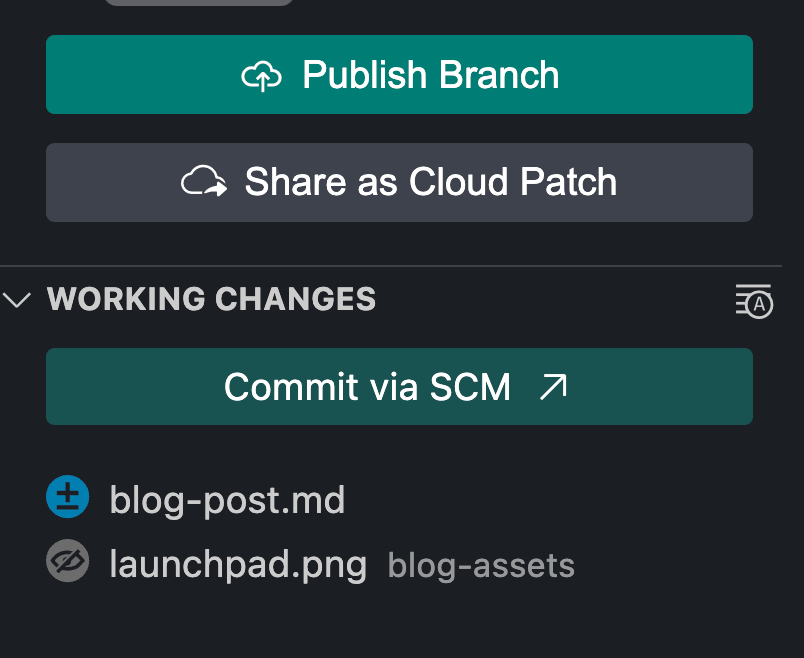
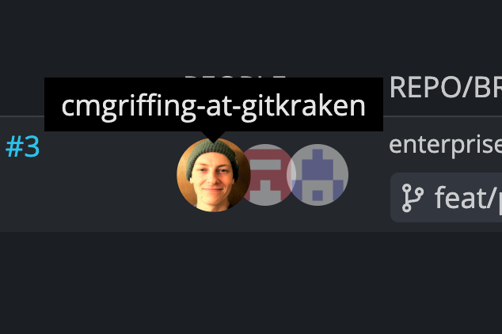
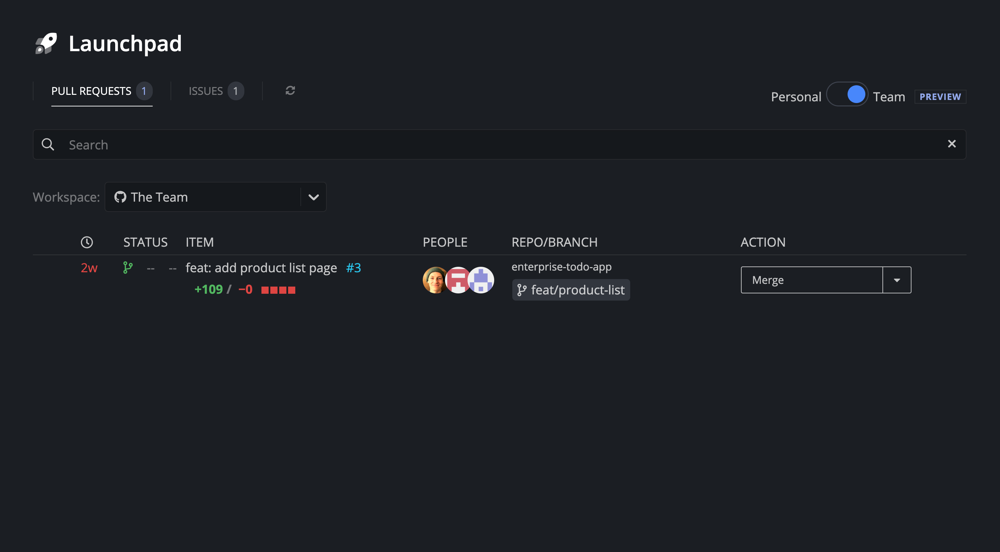

# Web Compoments are Lit with Lit

We use [Lit](https://lit.dev) to create shared Web Components that we can use across our [GitKraken DevEx platform](https://www.gitkraken.com/devex). This allows us to reduce repetition and keep our UIs consistent in aesthetics and functionality. Let's dig into Web Components, how they work, and why they exist.

## What Are Web Components?

Web Components are a broader term for a few specific specs and APIs.

- **Custom Elements** are the main thing people think of when talking about Web Components. They are able to be used in your own HTML as if they were native browser elements. eg: `<custom-counter data-initial-count="42" />`.
- **The Shadow DOM** is what hides away the complexity of the actual HTML elements that comprise a Custom Element. They also prevent external styles from cascading into your element which can be a headache for developers and library maintainers.
- **HTML Templates** are some browser native tags that help facilitate reusable markup and templating. This can be extremely useful for components that simply decorate arbitrary HTML that a developer can pass to a Custom Element. 

## History

Web Components date all the way back to 2011 where they were introduced at the Fronteers Conference in Amsterdam by Alex Russell. In that talk, Alex goes over the power of components and model-driven views. Then, in 2013, Google released Polymer as the first major library adopting the Web Component specs. This was massively influential since it was the canonical implementation of Material Design components as well. By releasing Polymer, Google pushed for Web Components to be evaluated in real-world use cases which helped the W3C move the specifications along their standardization process. While Polymer is irrelevant today, it's impact on pushing forward the web as a platform cannot be overstated.

With the standard solidifying and Internet Explorer dropping significantly in usage by 2017, major companies were starting to take Web Components seriously. [Ionic](https://ionicframework.com/) released [Stencil](https://stenciljs.com/) as a way of making some of the rough edges easier to manage. Just a year later, Angular released a feature which was called "Angular Elements". With Angular Elements, you could write components in a familiar Angular syntax and export them as browser-native Custom Elements to be used interoperably with any framework that supports them. To get a feel for which frameworks consume Custom Elements the easiest you can see a list at [custom-elements-everywhere.com](https://custom-elements-everywhere.com/).

## The Anatomy of a Web Component

Let's take a look at a very basic Web Component. This is a simple countdown timer with a button to start the countdown and a display of how many seconds are left. The usage would look something like this:

```html
<countdown-timer seconds=20></countdown-timer>
```

As you can see it just takes in a data-attribute of the number to countdown from. The nice part is that it is just its own element. No need to be concerned with the html contents of it for a consumer of the component. Let's take a look at what the definition of this component looks like. Here it is in it's entirety. We will break down the interesting bits afterward.

```javascript
class Countdown extends HTMLElement {
  connectedCallback() {
    const template = `
      <button class="countdown-start">Start the countdown</button>
      <span class="seconds-left"></span>
      `;
    this.innerHTML = template;

    // Useful references
    this.button = this.querySelector('.countdown-start');
    this.secondsDisplay = this.querySelector('.seconds-left');

    // Initialize
    this.button.addEventListener('click', () => this.handleClick());
  }

  handleClick() {
      if(this.hasAttribute('seconds')) {
        this.seconds = +this.getAttribute('seconds');
      } else {
        this.seconds = 10;
      }
      this.updateTimer();
      this.button.disabled = true;
      this.button.innerHTML = 'YOU DID IT';
      this.updateTimer();
      const counter = window.setInterval(() => {
        this.seconds--;
        this.updateTimer();
        if (this.seconds === 0) {
          window.clearInterval(counter);
          console.info('BOOM');
          this.dispatchEvent(new Event('boom'));
        }
      }, 1000);
  }

  updateTimer() {
      this.secondsDisplay.innerHTML = this.seconds;
  }

}
```

The first thing you should notice is that it is just a class that extends `HTMLElement`. That parent class is the official class from the Web Component specification and it sets up a bit more of the wiring to the browser APIs leaving us to only worry about our implementation details.

After that, take notice of the `connectedCallback`. In Angular this could be thought of as the `ngOnInit`. In older React class components it would be similar to the `componentDidMount` hook and in newer React hooks-based components it would be similar to a `useEffect` with an empty dependency array. It is basically where you want to do all of your components setup. Inside of that callback is where we create our template and attach it to the DOM. We also use `querySelector` to set up element references that we will use in our event handlers, etc. We also bind our click handler for the button that we just created. The click handler and `updateTimer` functions are just the implementation details of our component and might look similar to how you would wire up this logic in your framework of choice. A keen observer might also notice that this component also exposes an event to a consumer called "boom" so that we can do something outside the component in our app when the timer reaches zero.

Not shown here are some other callbacks you might want to use:
- `disconnectedCallback` is the callback that fires when the component is removed from the DOM. This is where you would want to clean up any intervals or other things that have the potential to become memory leaks.
- `attributeChangedCallback` is the callback that fires when the data attributes change. You can use this to update the state of the component from your application state.
- `adoptedCallback` is unique to Web Components and doesn't have an analog to any of the common frameworks you might be familiar with. This callback fires when the component is moved to a new HTML document using `adoptNode`. You probably won't need to use this unless you are dealing with iframes.

Mentioned above, adding the component to the registry is a fairly simple process. You just assign the class to a string value using a `define` method like so:

```javascript
window.customElements.define('countdown-timer', Countdown);
```

If you want to toy around with this simple example, you can use this codesandbox environment:

<iframe
    src="https://codesandbox.io/embed/np5jnj?view=Editor+%2B+Preview&module=%2Findex.html&hidenavigation=1"
    style="width:100%; height: 500px; border:0; border-radius: 4px; overflow:hidden;"
    title="web-component-example"
    allow="accelerometer; ambient-light-sensor; camera; encrypted-media; geolocation; gyroscope; hid; microphone; midi; payment; usb; vr; xr-spatial-tracking"
    sandbox="allow-forms allow-modals allow-popups allow-presentation allow-same-origin allow-scripts"
></iframe>

## Rough Around the Edges

While that was fairly simple to set up, there are some things about Web Components that could be easier to work with.

### Bundling and Lazy Loading

Since Web Components are just JavaScript, you can use them without any build tooling. However, things become a bit tricky when you want to only load them when they are used. Orchestrating when to load the JS and when to inject them into the registry is a bit of a chore. It also means that some organizations will do so in an ad-hoc way that might take a bit to learn about for a new dev onboarding onto a project.

### Shadow DOM Encapsulation

The encapsulation of the Shadow DOM can be a blessing and a curse. It is great for design systems where you have a finely curated set of styles and color palettes since the Shadow DOM prevents external CSS from interfering with the internals. However this becomes more problematic when you are consuming a more generalized third-party component library.

### Framework Interoperability

If you checked out custom-elements-everwhere.com, you may have noticed that some very popular frameworks don't fully support Web Components. React is probably the one that stands out the most. That means that you end up needing some kind of wrapper to make things play nicely in that ecosystem. Luckily, React 19 is prioritizing full support for Web Components. But, it still means that supporting them is a conscious effort that framework maintainers need to take into account.

### Reactivity

Web Components are not inherently reactive. They do expose a callback you can use to update the component when data-attributes change, but how you decide to handle that and rerender the state of the component's DOM is up to you. This is yet another place where an organization can make it work but without a standard it is something that makes onboarding a new dev more time-consuming.

## What is Lit?

Lit is a library and set of tools that help smooth out some of those rough edges we mentioned. It was originally created by the Google Chrome team as part of the Polymer project's efforts, but now it lives independently of the Polymer project. It is also an incredibly small library clocking in at 5kb after minification and gzip.

The main project is a [monorepo on GitHub](https://github.com/lit/lit) that includes the core building blocks of `lit`, `lit-html`, and `lit-element`. It also includes a framework specific wrapper for React, a library for localizing Lit components, and a couple starter boilerplates for JS and one for TS.

## Why Lit?

As mentioned, Lit helps smooth out some of the things about Web Components that are not as fun to work with.

- Framework Interoperability: Currently, Lit just has a wrapper for React. However, after looking at the support listed on custom-elements-everywhere, it seems most of the popular frameworks have full Web Component support.

- Reactivity: Lit provides a decorator that make properties reactive. When coupling this with a familiar component lifecycle and a familiar feeling `render` method, reactivity is intuitive and functions in a similar way to what you might be used to in other frameworks and tools.

- Directives: There are quite a few directives that you can use in Lit components to accomplish things like declarative class and style mapping, similar to how you might use `classnames` or `clsx`. There are also directives for loops and conditional logic as well as caching and change detection.

- Context: The `@lit/context` package helps us share state with the need for prop drilling in a very similar way to React's Context API.

- Documentation: Lit is certainly opinionated about some things but for the sake of broad usage they are decidedly unopinionated about things like bundling. While they heavily recommend a bundler, you can use Lit in any bundler you want. Lit provides some great documentation for those integrations.

- Localization: The localize package gives us a clean and easy way of making sure our components can be translated and used by people throughout the world. It helps make sure components rerender when locale changes. While it is only 1.27kb of extra JS, you can even compile the localization in a way that eliminates that extra JS overhead.

## How We Use Lit

Here at GitKraken, we use Lit to share components across our entire platform such as [GitKraken Desktop](https://www.gitkraken.com/git-client) and [GitLens for VSCode](https://www.gitkraken.com/gitlens). Several components are focused on styling and functionality for common elements such as buttons, inputs, tooltips, and more. 



Beyond the basic elements, we have more interesting things like Menus, Popovers, and Avatars.



We even use Lit to power some of our common platform-specific components such as our pricing calculator, complexity indicator, and even our Launchpad.



## Wrapping Up

That pretty much wraps things up. I hope you enjoyed learning about Web Components and how we use them at GitKraken. Hopefully, you are inspired to use Web Components in your applications to reduce duplication and keep your styling and functionality consistent.
